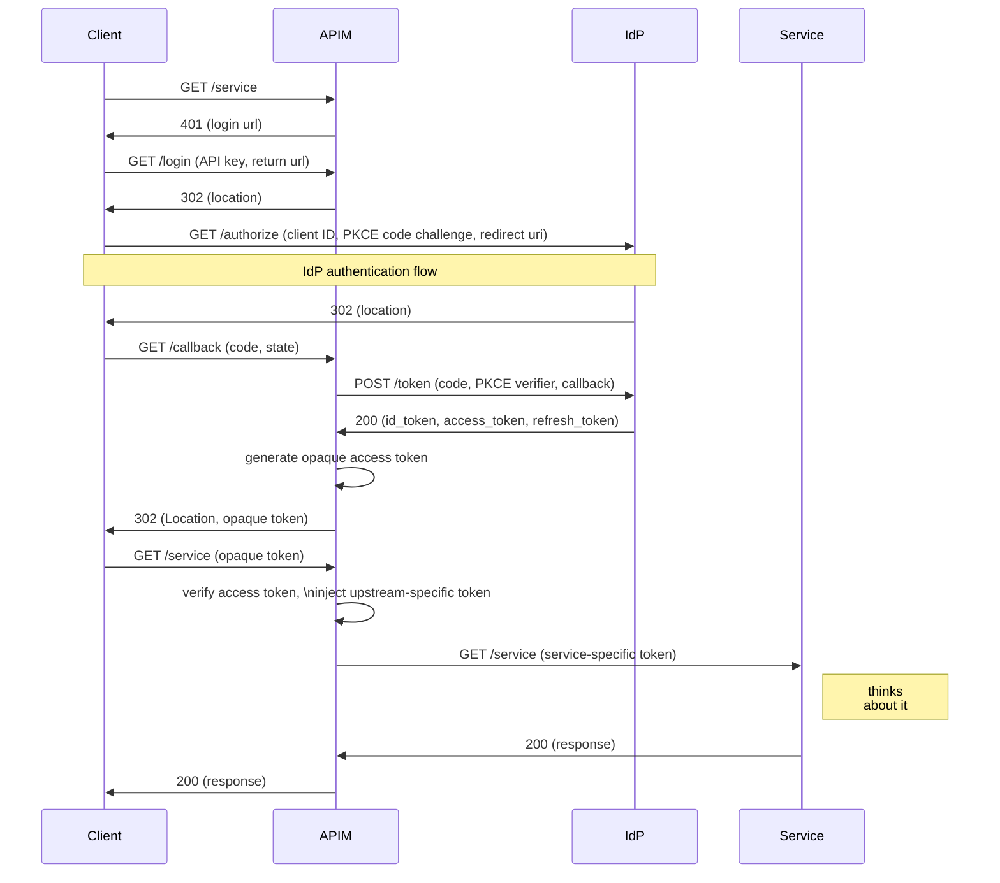

```mermaid
sequenceDiagram
  participant B as Client
  participant A as APIM
  participant IdP as IdP

  B->>A: GET /service
  A->>B: 401 (login url) 
  B->>A: GET /login (API key, return url)
  A->>B: 302 (location)
  B->>IdP: GET /authorize (client ID, PKCE code challenge, redirect uri)
  Note over B,IdP: IdP authentication flow
  IdP->>B: 302 (location)
  B->>A: GET /callback (code, state)
  A->>IdP: POST /token (code, PKCE verifier, callback)
  IdP->>A: 200 (id_token, access_token, refresh_token)
  A->>A: generate opaque access token 
  A->>B: 302 (Location, opaque token) 
  B->>A: GET /service (opaque token) 
  A->>A: verify access token, \ninject upstream-specific token
  A->>Service: GET /service (service-specific token)
  Note right of Service: thinks<br/>about it
  Service->>A: 200 (response)
  A->>B: 200 (response)
```
